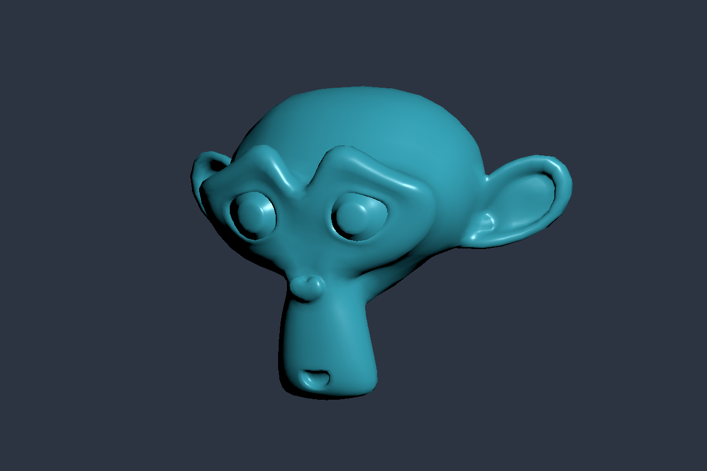

# filly

filly is a small Python 3D renderer for psychophysics stimuli, built on Google Filament. See
[spec.md](spec.md) for the project requirements.

The current build targets Windows and Linux x86_64 with OpenGL. It provides GLB/glTF loading,
perspective, lens, and orthographic cameras, model and node transforms, animation, material
variants, editable directional, sun, point, and spot lights, HDR panorama and prefiltered KTX
environment lighting, glass refraction, diffuse transmission, anisotropy, iridescence,
offscreen targets, and NumPy readback. Output is sRGB-encoded by default, or linear on request,
for offscreen and shared textures alike. Color grading encodes by default; an explicit opt-in lets
the GPU encode instead, which saves about 0.5 ms per 1080p frame and rejects options that need
color grading. The default tone mapper keeps neutral colors neutral.
All of Filament's tone mappers, FXAA, MSAA, SSAO, bloom, dithering, fog, depth of field, and
vignette are available as scene properties; each effect is off until requested, and none reads
earlier frames.
`model.clone()` makes more instances of an asset loaded with `clonable=True`; they share its
geometry and shaders.
Textures from NumPy arrays, updated in place for per-frame stimuli such as noise masks and
gratings, go into the base color or emissive slot of any glTF or generated material, with UV
transforms for drifting. A host OpenGL texture can be a material input without a copy.
Meshes come from NumPy arrays, with helpers for planes, boxes, spheres, and cylinders, and deform
in place. Each `render()` call can take its own camera and viewport, so two eyes render side by
side into one target.
Core glTF materials and Filament's glass match Filament's `gltf_viewer` to within two 8-bit levels
in the [reference comparison](docs/how-to/reference-comparison.md). Volumes under scaled parent
nodes differ on purpose: filly applies the parent scale, as `KHR_materials_volume` requires.
Animation includes supported material factors, light color/intensity/range and spot cones, camera projections, and
texture transforms through `KHR_animation_pointer`.
The loader also supports node visibility, modern meshopt data, and instance transforms.
A PsychoPy adapter renders into a shared GPU texture while PsychoPy controls the display flip.
It uses nanobind and a C++ interface that has no Python dependencies. glTF checks and
preparation run in that C++ core, so another frontend gets the same loader.

The only runtime dependency is NumPy. The extension links Filament, libwebp 1.5.0 (for WebP
textures), and a meshoptimizer 1.0 decoder statically. Pillow is needed only for the examples
and some tests, which encode PNG images.



Generate this image after building the package and installing Pillow:

```powershell
uv run --no-sync python examples/screenshot.py
```

The script downloads a pinned CC0 Suzanne mesh on first use and checks its hash.
See [asset details](docs/images/README.md) for credits.

With `psychopy-lib` installed, run the shared-texture example:

```powershell
uv run --no-sync python examples/psychopy_shared.py --frames 300
```

Pass a glTF or GLB path to display your own model:

```powershell
uv run --no-sync python examples/psychopy_shared.py "C:/models/stimulus.glb" --frames 600
```

The demo uses the first unambiguous imported camera when available, otherwise it fits the model without
changing its physical scale. Use `--fit-camera` to fit all geometry, including ground planes.
The demo plays the first
animation and uses authored lights when present. The overlay shows the file stem.
Omit the path to use Suzanne. Press Escape to stop. Use `--no-animation` to stop playback,
`--time 4` to inspect a pose, `--variant "Khronos Red"` to select a material variant, or
`--exposure 0` to brighten a dim asset. Run with `--help` for lighting and environment options.
Use `--camera "CameraNode"` to select an imported camera by its node name.
Authored-light scenes do not get an extra environment by default. Use `--environment-intensity`
to add one. This preserves lighting tests such as TrafficCone's reflective bands.
Use `--transparent` to draw over a regular PsychoPy grating. Add `--profile timing.csv`
to record CPU submission, shared-texture handoff, drawing, and flip timings.
Use `--shadows --shadow-map-size 1024` for shadow maps, including point lights. Add
`--show-environment --environment-rotation 45` to show and rotate the environment panorama.
The skybox is opaque; omit `--show-environment` when using `--transparent`.
Use `--lighting environment --view 35 22` to inspect iridescent materials with panorama lighting
and an angled camera. See the [dielectric sphere comparison](docs/reference/sample-assets.md#dielectric-iridescence).

More examples: `examples/drifting_grating.py` (a per-frame texture on a tilted plane),
`examples/stereo.py` (side-by-side stereo in a pyglet window), and `examples/shapes.py`
(generated and deforming meshes, offscreen). Each takes `--frames`.

For repeated asset loading, frame timing, and process/GPU memory reports:

```powershell
uv run --no-sync python examples/psychopy_stress.py --cycles 30 --frames 600 --transparent
```

See [stress testing](docs/how-to/stress-test.md) for refresh-rate checks and longer runs.

See [asset compatibility](docs/reference/api.md#asset-compatibility) for supported extensions and limits.

See [PsychoPy setup](docs/how-to/psychopy.md) for the Python 3.11 setup, which uses a prebuilt
Windows input-hook wheel. The full PsychoPy Builder package is not required.

The [wheel workflow](.github/workflows/wheels.yml) builds Windows and manylinux_2_28 wheels.
Python 3.12 and later share a `cp312-abi3` wheel; Python 3.10 and 3.11 have separate wheels.
Linux uses GLX and requires an X11 display, including XWayland, WSLg, or Xvfb.
See the [Linux and WSL setup](docs/how-to/build.md#build-on-linux) before running there.
See the [Khronos sample compatibility audit](docs/reference/sample-assets.md) for tested assets and remaining gaps.
PTB integration, macOS, native Wayland/EGL, and experimental display-timing validation remain future work.

## Documentation

- [Build and test](docs/how-to/build.md)
- [Render an image](docs/tutorials/offscreen.md)
- [Use PsychoPy and shared textures](docs/how-to/psychopy.md)
- [Use pyglet, moderngl, or zengl with shared textures](docs/how-to/gl-hosts.md)
- [Measure timing and resource stability](docs/how-to/stress-test.md)
- [Compare with Filament's gltf_viewer](docs/how-to/reference-comparison.md)
- [API reference](docs/reference/api.md)
- [Validation results](docs/reference/validation.md)
- [Design and current limits](docs/explanation/design.md)
