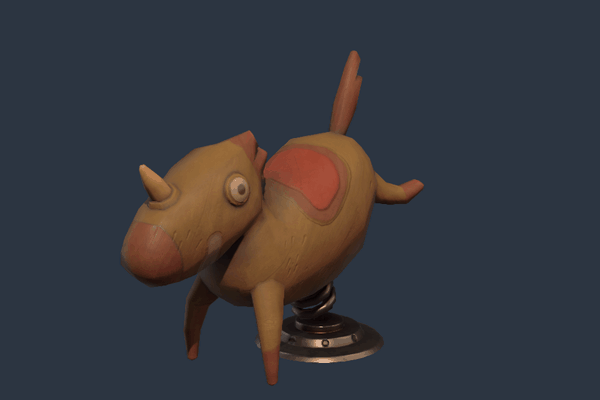

# filly

filly is a Python 3D renderer for glTF scenes, built on
[Google Filament](https://github.com/google/filament).

Load a glTF model, light it, pose it, and render it. You get the result as a NumPy image, or
filly draws it into an OpenGL texture that your own window shows. Your program keeps control of
the window and of frame timing, so filly fits into applications that already own a display loop,
such as PsychoPy experiments or pyglet, moderngl, and zengl programs.



*"Wooden Playground Horse" by [Batuhan13](https://sketchfab.com/Batuhan13),
[CC BY 4.0](http://creativecommons.org/licenses/by/4.0/). See [attribution](examples/assets/ATTRIBUTION.md).*

## Install

filly is not on PyPI yet. [Build it from source](docs/how-to/build.md).

It needs Python 3.10 or later, Windows or Linux on x86_64, and an OpenGL 4.1 driver. On Linux,
offscreen rendering works without a display. macOS is not supported.

## Render an image

```python
import filly
from PIL import Image  # only to save the image

with filly.Renderer() as renderer:
    scene = renderer.create_scene()
    horse = scene.load("examples/assets/wooden_playground_horse.glb")
    horse.apply_animation(0, 1.25)  # a pose from its spring animation

    camera = scene.create_camera()
    camera.set_perspective(fov_y=30, near=0.1, far=100)
    camera.frame(horse, direction=(-1, -0.3, -1), aspect=800 / 600)
    scene.camera = camera
    scene.add_directional_light(direction=(-1, -1, -2), intensity=100_000)

    target = renderer.create_render_target(width=800, height=600)
    renderer.render(scene, target)
    Image.fromarray(target.read()).save("horse.png")  # (600, 800, 4) uint8 RGBA
```

## Draw in a PsychoPy window

filly renders into a texture that PsychoPy draws directly, with no copy through the CPU.
PsychoPy still flips the window.

```python
from psychopy import core, visual
from filly.integrations.psychopy import SharedTarget, create_renderer

win = visual.Window((1024, 768), units="pix")
renderer = create_renderer(win)  # shares the window's OpenGL context
scene = renderer.create_scene()
horse = scene.load("examples/assets/wooden_playground_horse.glb")
camera = scene.create_camera()
camera.set_perspective(fov_y=30, near=0.1, far=100)
camera.frame(horse, aspect=1)
scene.camera = camera
scene.add_directional_light(direction=(-1, -1, -2), intensity=100_000)

target = SharedTarget(renderer, win, 512, 512)
stim = target.as_psychopy_texture()  # an ImageStim: position, size, masks, and opacity work
clock = core.Clock()
while clock.getTime() < 3:
    horse.apply_animation(0, clock.getTime())
    renderer.render(scene, target)
    stim.draw()
    win.flip()

target.close()
renderer.close()
win.close()
```

Close the target, then the renderer, then the window. The same pattern works with a
[pyglet, moderngl, or zengl window](docs/how-to/gl-hosts.md).

## Features

- **glTF 2.0:** GLB and glTF files, skinning, morph targets, animation, material variants, and
  the common material extensions, such as clearcoat, sheen, transmission, and iridescence.
  See [asset compatibility](docs/reference/api.md#asset-compatibility).
- **Cameras and lights:** perspective and orthographic cameras, camera framing, and directional,
  sun, point, and spot lights with optional shadows. Image-based lighting comes from an HDR
  panorama or prefiltered KTX files.
- **Stimuli from arrays:** textures and meshes from NumPy arrays, updated in place each frame,
  for gratings, noise, or deforming shapes.
- **Predictable output:** sRGB by default, or linear on request. Effects such as antialiasing,
  fog, and bloom are off until you enable them. With default settings, the same scene gives the
  same pixels on every frame.
- **Several views per frame:** each `render()` call can take its own camera and viewport, for
  example for side-by-side stereo.
- **Browsers:** the same core compiles to WebAssembly for WebGL2. It renders into a texture
  that the page's own renderer draws, such as PIXI in PsychoJS. See
  [the web build](docs/explanation/web.md).

## Examples

Each example is in `examples/` and runs with `python examples/<name>.py`.

| Example | Shows |
| --- | --- |
| `screenshot.py` | The animation above (`--gif`), or a still image, rendered offscreen. |
| `psychopy_shared.py` | A model in a PsychoPy window. Pass your own GLB path. |
| `pyglet_shared.py`, `moderngl_shared.py`, `zengl_shared.py` | The same in other OpenGL hosts. |
| `drifting_grating.py` | A texture updated every frame on a tilted plane. |
| `stereo.py` | Two cameras side by side in one window. |
| `shapes.py` | Generated and deforming meshes. |

## Documentation

- Tutorial: [render an image](docs/tutorials/offscreen.md)
- How-to guides: [build and test](docs/how-to/build.md),
  [use PsychoPy](docs/how-to/psychopy.md), [use other OpenGL hosts](docs/how-to/gl-hosts.md),
  [measure timing](docs/how-to/stress-test.md), [profile a frame](docs/how-to/profile.md),
  [compare with Filament's viewer](docs/how-to/reference-comparison.md),
  [use filly in a web page](docs/how-to/web.md)
- Reference: [API](docs/reference/api.md), [performance](docs/reference/performance.md),
  [validation](docs/reference/validation.md), [sample assets](docs/reference/sample-assets.md)
- Explanation: [design and limits](docs/explanation/design.md),
  [tested assumptions](docs/explanation/assumptions.md),
  [material precompilation](docs/explanation/material-precompilation.md),
  [the web build](docs/explanation/web.md)

## License

filly is released under the [MIT License](LICENSE).

It links [Filament](https://github.com/google/filament) (Apache 2.0),
[meshoptimizer](https://github.com/zeux/meshoptimizer) (MIT),
[libwebp](https://chromium.googlesource.com/webm/libwebp) (BSD), and
[cgltf](https://github.com/jkuhlmann/cgltf) (MIT). Their licenses are installed with the package.
