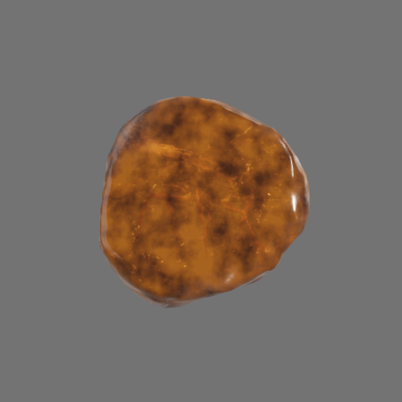
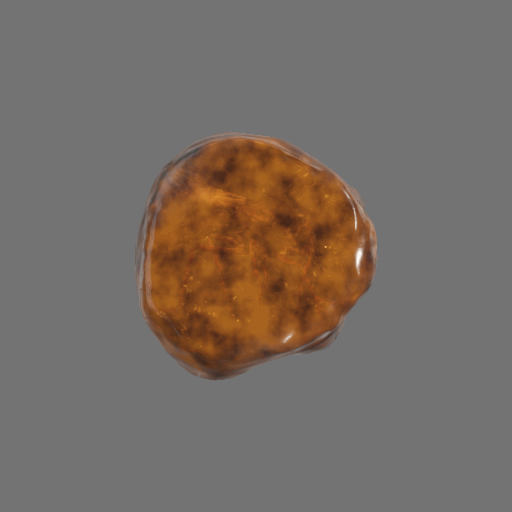
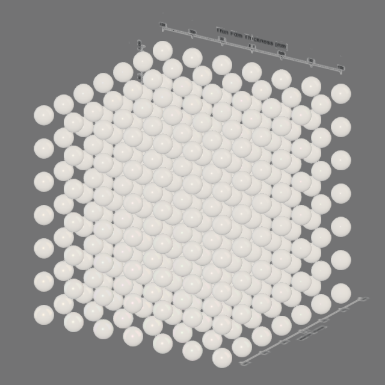
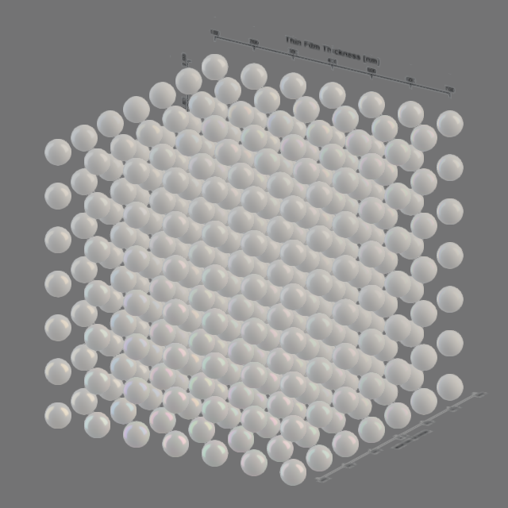

# Khronos sample compatibility

## Scope

The September 27, 2026 rerun used all 150 catalog entries from
[glTF-Sample-Assets at c6a6bd1](https://github.com/KhronosGroup/glTF-Sample-Assets/tree/c6a6bd13ab2b3c685c7903d03561b8a9392f38b8).
It selected `glTF-Binary` when available, otherwise `glTF` or the first listed variant.
This is one variant per asset, not every encoding in the repository.

Each asset ran in a separate process on Windows, Python 3.12.11, and Intel Iris Xe OpenGL 4.5.
The default compiled material mode captured two frames with refraction and postprocessing enabled.
It used the first imported camera with an unambiguous name, when available. Otherwise it fitted
two perspective views to the full bounds. Frames are 320 pixels high; imported cameras retain
their authored aspect ratio. For animated assets, the second frame evaluated clip 0 at its midpoint.
Other clips, material variants, additional cameras, and all animation times were not checked.
The source and reference-image download was about 604 MiB. Each file was checked against its pinned Git blob hash.

## Results

| Result | Assets |
| --- | ---: |
| Loaded and produced both images | 149 |
| Rejected with an asset error | 1 |
| Native process aborted | 0 |

These are load/render smoke results, not 149 visual-conformance passes. Two rendered assets
produce unsupported-extension warnings. The [per-asset CSV](sample-assets.csv) lists every selected
variant, result, error, warning, and known approximation. The local HTML gallery includes all
150 catalog reference images. Click an image to open it at full size.
NodePerformanceTest was rerun after its fixes. ScatteringSkull, TrafficCone, TransmissionTest,
and XmpMetadataRoundedCube were reloaded after the draft-extension removal described below.
Seven glass samples were rerun after the September 28 refraction-filter correction:
MosquitoInAmber, ChronographWatch, TransmissionRoughnessTest, TransmissionTest, CompareDispersion,
DispersionTest, and GlassVaseFlowers. IridescenceDielectricSpheres was then rerun with the
preview settings described below. Other entries retain the earlier full-audit results.
The September 29 return to Filament's own transmission and volume shading changes glass images;
the audit entries above predate it. See [the gltf_viewer comparison](../how-to/reference-comparison.md)
for current glass results.

## Draft extensions and metadata

The renderer does not implement the unratified `KHR_materials_volume_scatter` and
`KHR_materials_retroreflection` extensions. These extensions produce the usual unsupported-extension
warning, or an error in strict mode or when required.

`ScatteringSkull` loads its diffuse-transmission, volume, IOR, and dispersion combination. Its
scattering data is ignored, so the skull uses local thickness and absorption only. It does **not**
reproduce its [reference image](https://github.com/KhronosGroup/glTF-Sample-Assets/tree/c6a6bd13ab2b3c685c7903d03561b8a9392f38b8/Models/ScatteringSkull).
The diffuse material preserves glTF UV orientation. A regression test uses vertically asymmetric
base-color and thickness textures.

`TrafficCone` was tiny because the old audit fitted its large ground plane and ignored its
authored camera. The audit and PsychoPy demo now select an unambiguous imported camera by default.
Authored-light scenes no longer receive an extra environment light by default. Both cones are
visible. Their retroreflective bands use ordinary specular reflection. Point-light shadows are
available through explicit scene and light settings. The audit leaves shadows disabled. See the
[upstream comparison](https://github.com/KhronosGroup/glTF-Sample-Assets/tree/c6a6bd13ab2b3c685c7903d03561b8a9392f38b8/Models/TrafficCone).

`KHR_xmp` and `KHR_xmp_json_ld` contain only metadata. The loader ignores them without a warning,
also in strict mode.

## Amber and material corrections

[MosquitoInAmber](https://github.com/KhronosGroup/glTF-Sample-Assets/tree/c6a6bd13ab2b3c685c7903d03561b8a9392f38b8/Models/MosquitoInAmber)
looks nearly opaque in `gltf_viewer`. Filament's volume shader scales thickness by the mesh
node's own scale and omits the parent's 0.1 scale, so the amber is ten times thicker than
`KHR_materials_volume` specifies. filly uses the complete node transform. This asset
therefore differs from `gltf_viewer` (MAE 3.07, maximum 175 of 255; see
[the comparison](../how-to/reference-comparison.md#results)). An earlier version also spread
rough-glass blur over an estimated volume travel distance; that was removed.

Perspective transmission is now exactly Filament's. Orthographic views, for which Filament defines
no blur, use Filament's blur for a 45-degree perspective view. These unedited captures use the
same lighting and a 45-degree perspective view and an orthographic view of the same height:

| Perspective, 45 degrees | Orthographic |
| --- | --- |
|  |  |

Asset credits are in the [image notes](../images/README.md). This is a screen-space
approximation: it does not trace the gap to background geometry or multiple glass
surfaces. The demo
defaults to perspective projection. Use `--projection orthographic` to change it. A brighter `--background` improves contrast
through glass. Use `--show-environment` to display a loaded or studio panorama. Screen-space
refraction cannot sample ordinary PsychoPy drawing outside the Filament scene.

To capture and time the same glass asset with both projections, run:

```powershell
uv run --no-sync python tools/benchmark_refraction.py .deps/sample-audit/assets/Models/MosquitoInAmber/glTF-Binary/MosquitoInAmber.glb
```

The tool writes PNG captures, frame-time CSV files, and a JSON summary to
`.deps/refraction-benchmark`. Timings include CPU submission and a completion wait, not GPU-only time.

The audit also led to these corrections:

- `DiffuseTransmissionTeacup` and `MandarinOrange`: use the occlusion-sampler name expected by
  gltfio. The mismatch previously caused a native abort.
- `CompareDispersion`: distinguish volume shaders with and without dispersion in the material
  cache. The SDK's key equality omitted that flag, which could select a shader without the required uniform.
- `Box With Spaces` and generated Unicode-path fixtures: decode percent escapes once and load
  external resources through Unicode filesystem paths. The loader reads external buffers itself
  and gives gltfio the loaded memory, because the desktop SDK bypasses its URI cache for buffers.

Regression tests compare absorption with equivalent mesh, parent, and model-root scales in both
material modes, including iridescent volume materials.
Other tests cover occlusion strength, dispersion cache insertion order, and escaped buffer names.
The earlier 140-test Windows suite passed in 31.94 seconds. Eight selected assets also completed
the audit in fast mode: MosquitoInAmber, CompareDispersion, DispersionTest, DiffuseTransmissionTeacup,
MandarinOrange, GlassVaseFlowers, ChronographWatch, and TransmissionRoughnessTest. The amber
PsychoPy example completed a 30-frame smoke run with perspective projection and a gray background.
This catalog audit and these material corrections have not yet been retested on Linux.
The corrected TrafficCone PsychoPy demo also
completed 90 frames; see [validation results](validation.md) for timing and test limits.

## Dielectric iridescence

`IridescenceDielectricSpheres` loads its film parameters in both material modes. Two preview
choices hid their effect: the front camera overlaps the rows of its 7 by 7 by 7 sphere grid,
and the 100000-lux directional light washes out the dielectric film colors. An angled camera
and environment lighting make the colors visible.

These captures use the same orthographic camera, environment, exposure, and materials.
The second capture removes the directional light. Neither image is a conformance reference.

| Directional light and environment | Environment only |
| --- | --- |
|  |  |

Both local galleries now capture this asset at 640 pixels high with `--lighting environment`,
`--projection orthographic`, and `--view 35 22`. The report records these preview settings. Other
catalog entries retain their previous settings.

There is also a shader limitation. [Filament 1.77.1](https://github.com/google/filament/blob/v1.77.1/shaders/src/surface_brdf.fs)
evaluates thin-film Fresnel at the view-normal angle, then fits a normal-incidence reflectance
for its regular shading model. Its direct diffuse lobe omits the maximum-channel energy
weighting specified by [KHR_materials_iridescence](https://github.com/KhronosGroup/glTF/blob/main/extensions/2.0/Khronos/KHR_materials_iridescence/README.md).
The preview controls do not correct this approximation. No native shader changed in this update.

## Remaining failures

| Asset | Finding |
| --- | --- |
| `AnimationPointerUVs` | Four pointer targets occur twice in the same clip. The loader rejects duplicate targets. |

The duplicate-target rejection agrees with
[KHR_animation_pointer](https://github.com/KhronosGroup/glTF/blob/main/extensions/2.0/Khronos/KHR_animation_pointer/README.md#operation):
one property cannot have multiple channels in the same clip. The audit did not modify the source asset.

## Large-scene crash correction

`NodePerformanceTest` now loads and renders both audit views. Its 10,000 meshes and materials
previously queued about 6.43 MB of backend commands before a flush, overflowing Filament's
default command storage. Both offscreen and shared-context engines now use a 12 MiB command
ring with the SDK's 1 MiB minimum batch size. Windows commits the ring twice, 24 MiB per renderer.
The budget remains finite; larger scenes can still exceed SDK resource limits.

The SDK's default backend handle arena also filled on this asset. The driver then logged
"HandleAllocator arena is full" and used slower heap allocations. The engines now reserve a
32 MiB handle arena. The 10,000-mesh test overflowed 16 MiB and fit in 24 MiB.
Regression tests generate 10,000 separate meshes and materials, then load, draw, edit, and close
the asset twice through both offscreen and shared-texture engines. They fail if the handle-arena
warning appears. Child processes isolate any future native abort.

## New coverage and remaining approximations

| Asset | Result or limitation |
| --- | --- |
| `MeshoptCubeTest` | Modern meshopt data now decodes, including version 1 vertex data and the COLOR filter. |
| `CubeVisibility`, `LightVisibility`, `NodeVisibilityTest` | Authored visibility, parent inheritance, and boolean animation now apply to meshes and lights. Cameras remain usable. |
| `SimpleInstancing` | Instance transforms now render through mesh-sharing child nodes. Explicit GPU draw batching remains unimplemented. |
| `TrafficCone` | Draft retroreflection is ignored with a warning. |
| `ScatteringSkull` | Draft volume scattering is ignored with a warning. Diffuse transmission uses local thickness and absorption. |
| `TransmissionTest`, `XmpMetadataRoundedCube` | XMP metadata is ignored without a warning. |

Layered transmission, offscreen refracted content, background-distance-dependent blur, and precise
reference-renderer parity remain limits. Tests of the sample catalog do not establish full glTF
conformance, calibrated color, or display timing.

## Repeat the audit

Install Pillow and build the current extension, then run:

```powershell
uv run --no-sync python tools/check_sample_assets.py
```

The tool caches downloads in `.deps/sample-audit/assets`, keeps each asset's upstream README
and catalog screenshot,
and writes `report-archive.json` and `gallery-archive.html` under `.deps/sample-audit`.
Each child process has a 120-second timeout. An error or native abort is recorded without
stopping the rest of the catalog. No Git checkout is needed.

To check only selected assets:

```powershell
uv run --no-sync python tools/check_sample_assets.py --models MosquitoInAmber CompareDispersion DiffuseTransmissionTeacup
```

A selected run replaces that mode's report with the selected results. Use a separate `--output`
directory to retain an earlier report. `--download-only` fetches sources without creating a renderer.
Asset licenses remain those of their upstream authors. The gallery links each source and does not
relicense the generated images or source models.
